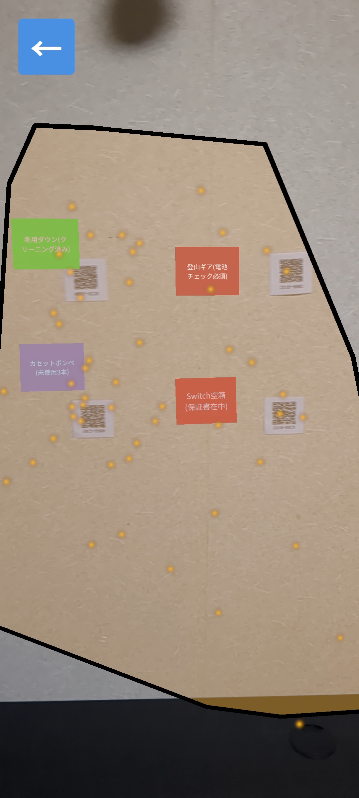
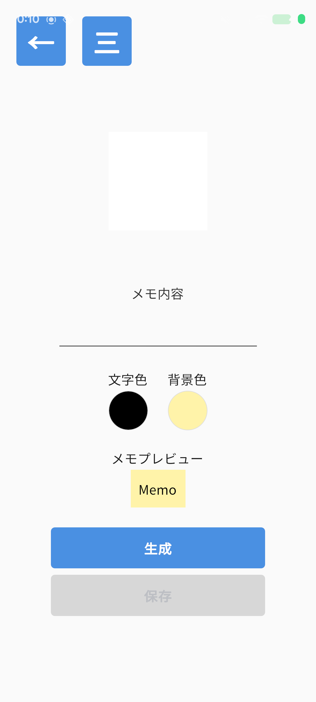
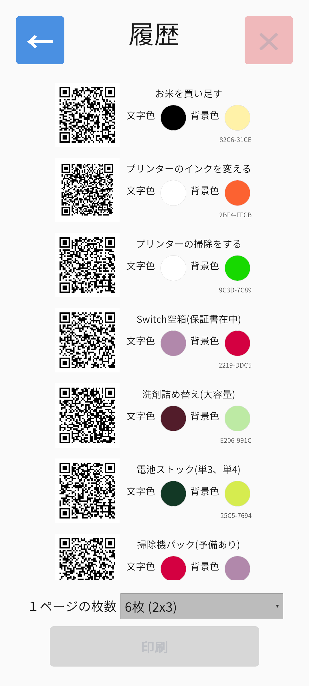

# AR Location Memo App  
### QRコードを用いて場所と情報を紐付けるAR管理アプリ

## 動作デモ
- デモ動画：https://www.youtube.com/watch?v=Z_ops-AR4e8

<table>
  <tr>
    <td align="center">
       
      AR画面
    </td>
    <td align="center">
       
      メモ作成画面
    </td>
    <td align="center">
       
      メモ一覧画面
    </td>
  </tr>
</table>

---

## 1. プロジェクト概要

本アプリは、現実世界の場所やモノに対してQRコードを介し、デジタル情報を付与・管理できるARアプリケーションです。

物理的なラベルの代替にとどまらず、見た目を損なわずに情報量を拡張することを主な目的として設計しています。

QRコードを読み取ったタイミングでのみ情報を表示することで、空間の視認性を保ちながら、必要な情報へアクセスできる仕組みを実現しています。

---

### 解決する課題

- **情報量の制限**  
  物理ラベルでは記載できない詳細な情報を、QRコードを通じて一元管理

- **視覚的ノイズの多さ**  
  常時表示される情報を排除し、必要なときのみ表示

- **管理作業の非効率性**  
  「デジタルで作成 → 一括印刷 → 貼付」というワークフローを前提とした設計

---

## 2. 技術スタック

| カテゴリ | 技術 | 用途 |
| :--- | :--- | :--- |
| 開発環境 | Unity 2022.3.62f1 | 安定性とAR対応 |
| UI | UI Toolkit | 柔軟なレイアウト管理 |
| AR | AR Foundation | 空間認識 |
| スキャン | Java（Google ML Kit） | 高速・高精度なQR読み取り |
| データ管理 | JSON / PlayerPrefs | 軽量なデータ保存 |

---

## 3. 技術的な工夫と課題解決

### 3.1 トラッキング方式の再設計

当初は、AR空間上で配置から閲覧までを完結させることを目指し、GPSや平面検知による配置を採用していました。

しかし、屋内では位置精度が安定せず、特に特徴点の少ない壁面では配置のズレが大きく、実用には課題が残りました。

そこで、ARのみで完結させる方針を見直し、QRコードを現実空間上のマーカーとして扱う方式へと切り替えました。

QRコードの検出位置を基準にすることで、配置位置を安定して再現できるようになり、実用的な精度を確保しています。

---

### 3.2 ネイティブ統合によるスキャン精度の向上

Unity標準のカメラ処理では、低照度環境や斜めからの読み取りにおいて認識率が低下する課題がありました。

この問題に対し、Androidネイティブの「Google ML Kit」をJNI経由で組み込むことで対応しています。

結果として、

- 読み取り速度の向上  
- フォーカスの高速化  
- 角度耐性の改善  

を実現し、スムーズなスキャン体験を提供できるようになりました。

---

### 3.3 印刷処理のパフォーマンス改善

QRコードをA4レイアウトで生成する際、処理負荷が高く、共有画面の表示までに待機時間が発生していました。

この課題に対しては、

- 非同期処理の導入  
- 生成処理の分割  
- メモリ使用量の最適化  

を行うことで、体感的な待ち時間を大幅に削減しています。

---

### 3.4 位置・角度の精度に関する課題

QRコードを基準とした配置自体は実現できていますが、角度や微細な位置ズレについては完全な補正には至っていません。

現時点では実用上問題ないレベルで動作していますが、今後の改善項目として継続的に調整を行う予定です。

---

## 4. 設計において意識したポイント

- **役割の分離**  
  UIの処理とロジックを分離し、保守性とデバッグ効率を向上

- **処理の非同期化**  
  操作体験を損なわないよう、負荷の高い処理は非同期で実行

- **直感的な操作性**  
  最低限の説明で利用できるUI設計を意識

---

## 5. ライセンス

本アプリでは以下の外部ライブラリを使用しています。詳細は `ACKNOWLEDGMENTS.md` を参照してください。

- NativeShare  
- NativeGallery  
- ZXing.Net  
- Google ML Kit  
- Newtonsoft.Json  
- Google Fonts (Noto Sans JP)

## 6. セットアップ
### 動作環境
- Unity 2022.3.62f1 (LTS)
- Android（ARCore対応端末）

### 手順
1. 本リポジトリをクローン
2. Unityでプロジェクトを開く
3. Androidビルド設定を行う
4. 実機にビルドして起動

※QRスキャン機能はAndroidのみ対応しています

### 注意点
- カメラ権限の許可が必要です
- ARCore非対応端末では動作しません
